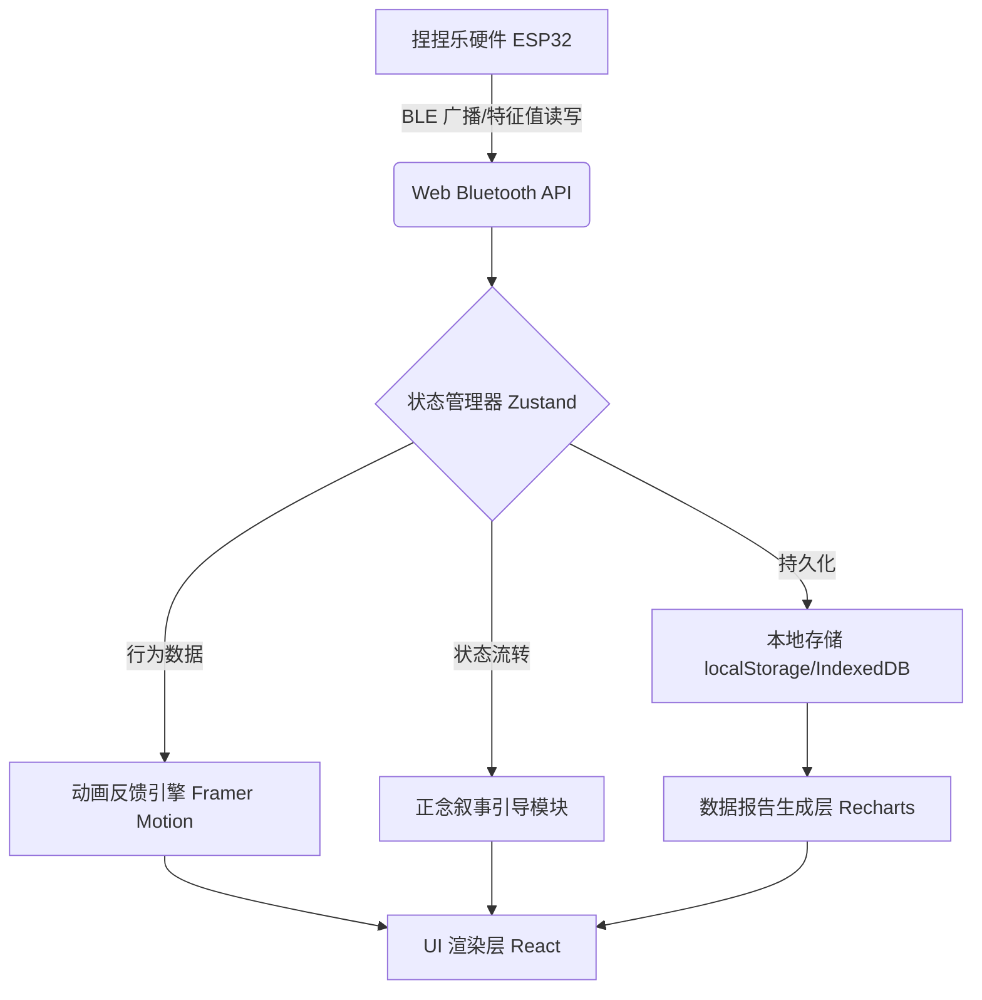

# 技术架构文档：AI Builder - 智能正念陪伴捏捏乐 App

## 1. 技术栈选型

考虑到快速构建原型、良好的跨平台支持以及后续可能需要打包为移动端应用或微信小程序的需求，本项目将采用以下现代前端技术栈构建 Web App 原型：

- **核心框架**: React 18
- **构建工具**: Vite (极速的开发体验)
- **路由管理**: React Router v6
- **状态管理**: Zustand (轻量、适合处理蓝牙状态和动画状态)
- **样式方案**: Tailwind CSS (快速构建 UI) + Framer Motion (实现高质量的物理动画和呼吸感动效)
- **图标与组件**: Lucide React
- **硬件通信**: Web Bluetooth API (用于原型开发和浏览器调试)

## 2. 系统架构设计

### 2.1 整体架构图


### 2.2 核心模块设计

#### 2.2.1 BLE 通信服务 (Bluetooth Service)
- 负责扫描、连接 ESP32 设备。
- 监听特定 Characteristic 的通知 (Notifications)，接收来自硬件的 50Hz 压力数据或已经计算好的行为状态（积极/消极/转化中）。
- 提供断线重连机制。

#### 2.2.2 状态管理 (Store)
使用 Zustand 管理全局状态：
- `deviceStatus`: 'disconnected' | 'connecting' | 'connected'
- `currentBehavior`: 'idle' | 'light_press' | 'hard_press' | 'rapid_press' | 'slap'
- `mindfulnessState`: 'positive' | 'negative' | 'transforming'
- `currentRole`: 选定的角色 ID
- `narrativeStep`: 当前叙事引导的阶段 (setup, conflict, guidance, resolution)

#### 2.2.3 动效引擎 (Animation Engine)
- 使用 Framer Motion 创建基于弹簧物理特性的动画。
- 角色的动画状态将直接绑定到 `currentBehavior` 和 `mindfulnessState` 变量上。
- 实现呼吸环组件，其缩放周期可以通过传入的 `duration` 属性动态改变，用于引导用户呼吸。

#### 2.2.4 记录与报告 (History & Analytics)
- 数据模型：记录单次 Session 的时长、起始状态、结束状态、触发消极行为的次数、成功转化的次数。
- 存储：初期使用浏览器的 `localStorage` 或 `IndexedDB` 进行本地存储。
- 图表：引入轻量级的图表库（如 Recharts）渲染情绪波动图和行为统计。

## 3. 目录结构规划
```text
src/
├── assets/            # 静态资源 (角色图片、字体)
├── components/        # 可复用组件
│   ├── layout/        # 布局组件
│   ├── character/     # 角色动画组件
│   ├── narrative/     # 叙事文字组件
│   └── charts/        # 数据图表组件
├── hooks/             # 自定义 Hooks
│   ├── useBluetooth.ts # 封装 Web Bluetooth API
│   └── useNarrative.ts # 处理叙事逻辑流转
├── pages/             # 页面视图
│   ├── Home.tsx       # 主控/互动页面
│   ├── Roles.tsx      # 角色选择页面
│   └── Report.tsx     # 历史记录页面
├── store/             # Zustand 状态管理
│   ├── bleStore.ts    # 蓝牙相关状态
│   └── appStore.ts    # 业务状态
├── utils/             # 工具函数 (数据解析、本地存储等)
├── App.tsx            # 根组件
└── main.tsx           # 入口文件
```

## 4. 关键交互流程：正念引导流
1. **触发**：`bleStore` 监听到连续 2 秒的 `rapid_press` 或 `slap`，将 `mindfulnessState` 设为 `negative`。
2. **Setup & Conflict**：UI 弹出提示框“你的动作很快...”，角色动画表现为轻微震动。
3. **Guidance**：进入引导模式，屏幕出现光晕。光晕按照 4-7-8 呼吸法（或简单 3 秒吸气 3 秒呼气）缩放。提示文字“试着按住我三秒”。
4. **验证**：监听接下来的硬件数据，如果识别到 `steady_press` 持续 3 秒，给予积极反馈分数。
5. **Resolution**：累积积极分数达到阈值，提示“现在比刚才稳定了”，角色恢复放松动画，记录一次“转化成功”并写入本地数据库。

## 5. 安全与隐私
- 蓝牙连接必须由用户显式手势（点击按钮）触发（Web API 安全限制）。
- 情绪数据初期全部保留在本地，不上传云端，确保用户隐私。
